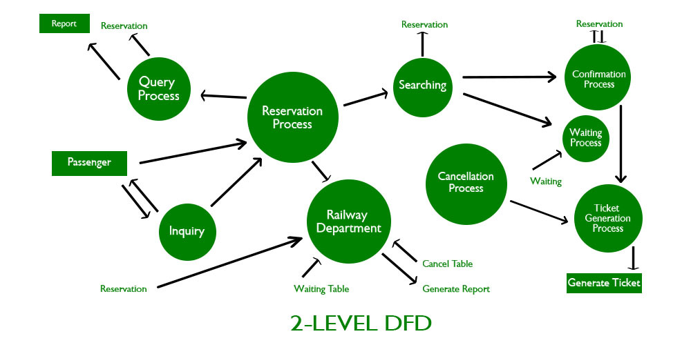

This is normal text

**Bold**

**What is HTML**

HTML stands for HyperText Markup Language



https://github.com/microsoft/vscode

# Heading 1

## Heading 2

### Heading 3

This is normal text
<b>This is bold text</b>

```html
<!DOCTYPE html>
<html lang="en">
  <head>
    <meta charset="UTF-8" />
    <meta name="viewport" content="width=device-width,initial-scale=1.0" />
    <title>Document</title>
  </head>
  <body>
    This is normal text
    <b>This is b tag</b>
    <i>This is i tag</i>
  </body>
</html>
```

Some of the void elements are `<hr/>`

| Name  | City   | Course   |
| ----- | ------ | -------- |
| Jay   | Rajkot | WD       |
| Ajay  | Surat  | FrontEnd |
| Sanay | Baroda | PHP      |

> Hey

:) :(

😒

- one
- two
  - three
